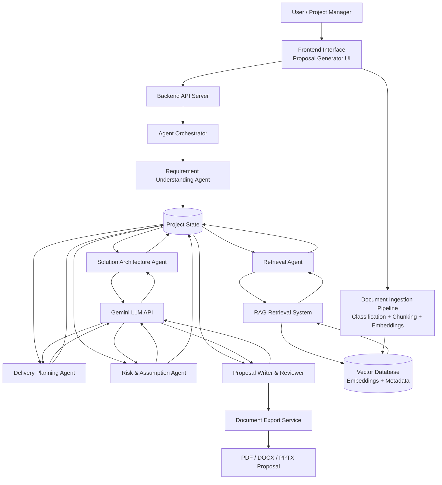
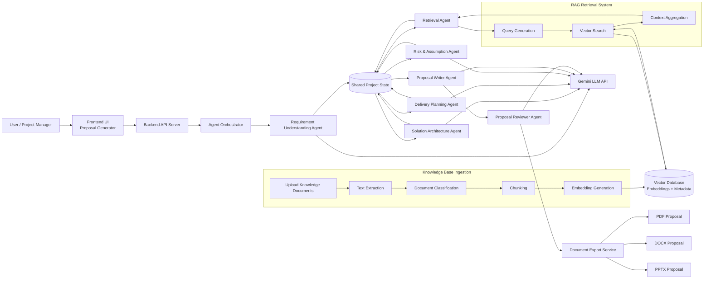

# SOW

# AI SOW / Proposal Creation Agent – System Design Document

## 1. Project Overview

The objective of this system is to build an **AI-powered Statement of Work (SOW) / Proposal Creation Agent** that assists Topcoder Project Managers in generating structured proposals from unstructured inputs such as:

- RFP documents
- requirement documents
- meeting transcripts
- problem descriptions
- bullet-point requirements

The system analyzes these inputs and produces a **complete professional proposal draft** that can be reviewed, edited, and shared with clients.

The generated proposal should include:

- Executive Summary
- Project Overview
- Scope of Work
- Technical Approach
- Deliverables
- Project Timeline
- Team Structure / Challenge Model
- Assumptions
- Risks and Mitigation
- Previous Experience
- Pricing / Effort Estimate (optional)
- Conclusion

The system should also support **learning from previous proposals and RFPs using RAG-based knowledge retrieval**.

---

# 2. High-Level System Architecture

The system is composed of five major layers.

1. Input Layer
2. Knowledge Layer (RAG)
3. Agent Orchestration Layer
4. Proposal Assembly Layer
5. Document Export Layer

High-level workflow:

Client Input

→ Requirement Analysis

→ Knowledge Retrieval

→ Solution Planning

→ Delivery Planning

→ Risk & Assumptions

→ Proposal Generation

→ Document Export

---

# 3. Input Layer

This layer processes incoming user inputs.

Supported inputs include:

- Text descriptions
- RFP documents (PDF / DOCX)
- Meeting transcripts
- Requirement documents

Responsibilities:

- File upload handling
- Text extraction
- Preprocessing and normalization

Output:

Clean requirement text describing the client problem.

Example input:

"A company wants to build an AI-powered helpdesk system that classifies support tickets and retrieves knowledge base answers."

---

# 4. Knowledge Layer (RAG)

The system uses Retrieval-Augmented Generation (RAG) to incorporate knowledge from previous projects.

### Knowledge Sources

- Previous RFP documents
- Previous proposal responses
- SOW documents
- Topcoder challenge specifications
- Architecture documentation
- Case studies

### Metadata Fields

Documents stored in the knowledge base contain metadata such as:

- doc_type (rfp / proposal / architecture / challenge_spec)
- domain
- industry
- technology

### Retrieval Strategy

The system uses:

Vector similarity search + metadata filtering.

Example retrieval strategy:

- Retrieve similar RFPs
- Retrieve similar proposals
- Retrieve architecture patterns

The retrieved context is used to guide the AI agents when generating the proposal.

---

# 5. Agent Orchestration Layer

The core reasoning pipeline consists of **six AI agents**.

These agents operate sequentially and update a shared project state.

Final pipeline:

1. Requirement Understanding Agent
2. Domain & Knowledge Retrieval Agent
3. Solution Architecture Agent
4. Delivery Planning Agent
5. Risk & Assumption Agent
6. Proposal Writer & Reviewer Agent

This design balances:

- reasoning depth
- proposal quality
- system speed

Estimated latency: 10–20 seconds per proposal.

---

# 6. Shared Project State

All agents operate on a shared structured data object called the **Project State**.

Example structure:

```
{
 problem_statement: "",
 project_domain: "",
 client_objectives: [],
 expected_outcomes: [],

 features: [],
 ai_components: [],
 integrations: [],

 architecture: {},
 technology_stack: [],

 scope_in: [],
 scope_out: [],

 deliverables: [],

 timeline: [],
 challenge_plan: [],
 team_structure: [],

 assumptions: [],
 risks: [],

 previous_experience: [],

 pricing_estimate: {}
}
```

Each agent updates this object.

This ensures context is preserved throughout the pipeline.

---

# 7. Agent Responsibilities

## 7.1 Requirement Understanding Agent

Purpose:

Convert unstructured client input into structured requirements.

Output fields:

- problem_statement
- project_domain
- client_objectives
- expected_outcomes
- features
- integrations
- scope_in
- scope_out

---

## 7.2 Domain & Knowledge Retrieval Agent

Purpose:

- Identify project domain
- Retrieve relevant historical examples from the knowledge base

Output:

- previous_experience
- retrieved_examples
- architecture_patterns

These results guide later agents.

---

## 7.3 Solution Architecture Agent

Purpose:

Generate the system architecture and technical approach.

Output fields:

- architecture
- technology_stack
- AI modules
- integration points

Example architecture components:

- frontend application
- backend services
- AI processing modules
- APIs and integrations

---

## 7.4 Delivery Planning Agent

Purpose:

Define how the project will be delivered.

Output includes:

- project timeline
- Topcoder challenge plan
- team structure

Example challenge structure:

Phase 1 — Architecture Challenge

Phase 2 — UI Design Challenge

Phase 3 — Backend Development Challenge

Phase 4 — AI Integration Challenge

Phase 5 — Testing Challenge

Also supports traditional team models.

---

## 7.5 Risk & Assumption Agent

Purpose:

Generate realistic project risks and assumptions.

Example outputs:

Assumptions:

- client provides API documentation
- datasets are available

Risks:

- unclear requirements
- integration complexity
- AI accuracy limitations

Mitigation strategies are also generated.

---

## 7.6 Proposal Writer & Reviewer Agent

Purpose:

Generate the final proposal and ensure it is complete and consistent.

Sections produced:

- Executive Summary
- Project Overview
- Scope of Work
- Technical Approach
- Deliverables
- Project Timeline
- Team Structure / Challenge Model
- Assumptions
- Risks and Mitigation
- Previous Experience
- Pricing / Effort Estimate (optional)
- Conclusion

This agent also performs a **self-review step** to improve clarity and completeness.

---

# 8. Proposal Assembly Layer

The proposal assembly layer organizes the structured content into a professional proposal format.

Final structure:

Executive Summary

Project Overview

Scope of Work

- In Scope
- Out of Scope

Technical Approach

Deliverables

Project Timeline

Team Structure / Challenge Model

Assumptions

Risks and Mitigation

Previous Experience

Pricing / Effort Estimate (optional)

Conclusion

---

# 9. Document Export Layer

The system supports exporting proposals into multiple formats.

Supported output formats:

PDF

DOCX

PPTX

Purpose:

PDF → client-ready proposal

DOCX → editable version for PM updates

PPTX → executive presentation format

---

# 10. End-to-End System Flow

Complete system workflow:

Client Input

→ Input Processing

→ Requirement Understanding Agent

→ Domain & Knowledge Retrieval Agent

→ Solution Architecture Agent

→ Delivery Planning Agent

→ Risk & Assumption Agent

→ Proposal Writer & Reviewer Agent

→ Proposal Assembly

→ Document Export

---

# 11. Design Principles

The system design emphasizes:

- structured reasoning workflow
- modular agent architecture
- context preservation via shared state
- RAG-assisted knowledge reuse
- professional proposal output

The goal is to create a system that behaves like an **AI assistant for Topcoder Project Managers**, capable of producing structured project proposals efficiently.

---

# 12. Future Work

Remaining decisions to finalize:

- technology stack
- backend framework
- frontend interface
- vector database selection
- LLM provider
- document generation tools

These will be determined during the implementation phase.

---

If you'd like, next we can create **two more documents that usually impress reviewers**:

1. **System Architecture Diagram description (for the submission)**
2. **Agent Prompt Design Document** (this is where many competitors lose points).

# Project State Schema (AI Proposal Agent)

The **Project State** is the shared structured object used by all agents in the system.

Each agent reads from and updates specific fields within this object.

This ensures:

- context preservation
- structured reasoning
- modular agent interaction

---

# 1. Project State Structure

```
project_state
│
├── project_info
├── requirements
├── scope
├── ai_components
├── architecture
├── technology_stack
├── deliverables
├── delivery_plan
├── risks
├── assumptions
├── previous_experience
└── pricing_estimate
```

---

# 2. Full Project State Example

```json
{
  "project_info": {
    "problem_statement": "",
    "project_domain": "",
    "client_objectives": [],
    "expected_outcomes": []
  },

  "requirements": {
    "features": [],
    "integrations": [],
    "data_sources": [],
    "target_users": []
  },

  "scope": {
    "in_scope": [],
    "out_of_scope": []
  },

  "ai_components": [
    {
      "name": "",
      "type": "",
      "description": "",
      "model_type": "",
      "input_data": "",
      "output": "",
      "training_required": false,
      "dataset_requirements": ""
    }
  ],

  "architecture": {
    "frontend": "",
    "backend": "",
    "ai_services": [],
    "data_storage": "",
    "integration_services": []
  },

  "technology_stack": [],

  "deliverables": [],

  "delivery_plan": {
    "timeline": [],
    "challenge_plan": [],
    "team_structure": []
  },

  "risks": [
    {
      "risk": "",
      "mitigation": ""
    }
  ],

  "assumptions": [],

  "previous_experience": [
    {
      "project_name": "",
      "domain": "",
      "description": ""
    }
  ],

  "pricing_estimate": {
    "architecture_hours": 0,
    "design_hours": 0,
    "development_hours": 0,
    "testing_hours": 0
  }
}
```

---

# 3. Field Explanations

## project_info

Contains high-level project description.

```
problem_statement
project_domain
client_objectives
expected_outcomes
```

Used in:

- Executive Summary
- Project Overview

---

## requirements

Functional and technical requirements.

```
features
integrations
data_sources
target_users
```

Example features:

- ticket classification
- knowledge base retrieval
- analytics dashboard

---

## scope

Defines the project boundaries.

```
in_scope
out_of_scope
```

Example:

In Scope

- AI helpdesk platform
- ticket classification

Out of Scope

- CRM migration
- legacy system replacement

---

## ai_components

All AI functionality required by the system.

Each component contains:

```
name
type
description
model_type
input_data
output
training_required
dataset_requirements
```

Example:

Ticket Classification

- type: NLP classification
- model_type: transformer model
- input_data: support ticket text
- output: ticket category

---

## architecture

Defines system architecture.

```
frontend
backend
ai_services
data_storage
integration_services
```

Example:

frontend: React dashboard

backend: Python API services

ai_services: classification service, semantic search

data_storage: PostgreSQL

---

## technology_stack

List of technologies used.

Example:

```
Python
React
PostgreSQL
Docker
```

---

## deliverables

Final deliverables for the client.

Examples:

- architecture documentation
- UI design assets
- backend APIs
- AI modules
- deployment documentation

---

## delivery_plan

Defines how the project will be delivered.

### timeline

Example:

- Architecture Design – 1 week
- Development – 3 weeks
- Testing – 1 week

### challenge_plan

Topcoder challenge structure.

Example:

Phase 1 — Architecture Challenge

Phase 2 — UI Design Challenge

Phase 3 — Backend Development Challenge

Phase 4 — AI Integration Challenge

Phase 5 — Testing Challenge

### team_structure

Example:

- Solution Architect
- Backend Engineer
- Frontend Engineer
- AI Engineer
- QA Engineer

---

## risks

Potential project risks.

Each entry includes:

```
risk
mitigation
```

Example:

Risk: unclear requirements

Mitigation: discovery workshop

---

## assumptions

Project assumptions.

Example:

- client provides API documentation
- datasets are available
- cloud infrastructure provided by client

---

## previous_experience

Similar projects for credibility.

Example:

```
AI Helpdesk Automation
Document Intelligence System
CRM Automation Platform
```

---

## pricing_estimate (optional)

Estimated effort for project phases.

Example:

```
Architecture – 40 hours
Design – 60 hours
Development – 200 hours
Testing – 60 hours
```

---

# 4. Agent Responsibilities

Each agent updates specific fields.

| Agent | Fields Updated |
| --- | --- |
| Requirement Understanding Agent | project_info, requirements, scope |
| Retrieval Agent | previous_experience |
| Solution Architecture Agent | ai_components, architecture, technology_stack |
| Delivery Planning Agent | delivery_plan, deliverables |
| Risk & Assumption Agent | risks, assumptions |
| Proposal Writer Agent | generates final proposal from project_state |

---

# 5. Design Principles

The project state is designed to:

- preserve context across agents
- structure AI reasoning
- map directly to proposal sections
- simplify prompt design
- enable modular system architecture

---

# 1. Purpose of the Review Step

The **Proposal Writer & Reviewer Agent** performs two tasks:

1. Generate the proposal
2. Review the proposal for completeness and quality

The review checks things like:

```
missing sections
logical inconsistencies
unclear descriptions
weak executive summary
missing risks or assumptions
timeline inconsistencies
```

Example issue:

```
Deliverables section mentions AI model
but Technical Approach does not describe it
```

The reviewer should detect that.

---

# 2. What the Reviewer Actually Produces

Instead of just saying "approved" or "rejected", the review agent should output something structured.

Example:

```
{
 "status":"needs_revision",
 "issues": [
"Executive summary is too short",
"Scope of work missing out-of-scope section",
"Technical approach does not describe AI components clearly"
 ],
 "suggestions": [
"Expand business value in executive summary",
"Add out-of-scope items",
"Clarify AI module architecture"
 ]
}
```

---

# 3. If the Proposal Passes Review

If everything looks good:

```
{
 "status":"approved"
}
```

Then the pipeline continues directly to:

```
Document Export
```

---

# 4. If the Proposal Fails Review

If the review detects issues, the system should **not stop completely**.

Instead:

```
Review agent identifies issues
↓
Proposal writer agent receives feedback
↓
Proposal is refined
↓
Second review check
```

Example pipeline:

```
Proposal generation
↓
Review
↓
Revision
↓
Final review
↓
Export
```

Usually **one revision loop is enough**.

---

# 5. Important Design Rule

Do **not allow infinite loops**.

Set a rule:

```
maximum 1 revision cycle
```

If after revision there are still issues, export anyway but mark:

```
"requires_pm_review": true
```

Because ultimately a **human PM will review the proposal anyway**.

---

# 6. Example Review Criteria

The reviewer should verify:

### Structural completeness

Check if all sections exist:

```
Executive Summary
Project Overview
Scope of Work
Technical Approach
Deliverables
Timeline
Team Structure
Risks
Assumptions
Conclusion
```

---

### Logical consistency

Example checks:

```
features align with architecture
deliverables align with scope
timeline aligns with challenge plan
```

---

### Professional tone

Example checks:

```
no vague wording
clear business value
clear solution description
```

---

# 7. Why This Improves Your System

Most competitors will just generate proposals like:

```
input → proposal text
```

Your pipeline becomes:

```
input
↓
proposal generation
↓
automated review
↓
refinement
↓
final proposal
```

This looks much more like a **real consulting workflow**.

---

# 8. Final Review Pipeline

```
Client Input
↓
Requirement Agent
↓
Retrieval Agent
↓
Solution Agent
↓
Delivery Planning Agent
↓
Risk & Assumption Agent
↓
Proposal Writer
↓
Proposal Reviewer
↓
(optional revision)
↓
Document Export
```

---

# 9. One Important Insight

The review agent does **not create new information**.

It only:

```
evaluate
detect issues
improve wording
ensure completeness
```

This keeps responsibilities clear.

# RAG System Design Document

**AI SOW / Proposal Creation Agent**

---

# 1. Purpose of the RAG System

The Retrieval-Augmented Generation (RAG) system enables the AI agents to leverage **historical knowledge and past project experience** when generating proposals.

Instead of generating proposals purely from the user input, the system retrieves relevant information from:

- past RFP documents
- previous proposal responses
- architecture documentation
- Topcoder challenge specifications
- case studies

This helps the system produce **realistic, context-aware, and domain-informed proposals**.

---

# 2. Knowledge Sources

The RAG knowledge base should contain the following document types:

| Document Type | Purpose |
| --- | --- |
| RFP Documents | Understanding typical client requirements |
| Previous Proposals | Reusing proposal structure and language |
| Architecture Documents | Learning system design patterns |
| Challenge Specifications | Learning Topcoder delivery structures |
| Case Studies | Providing domain experience examples |

These documents collectively form the **knowledge base** used for retrieval.

---

# 3. Document Upload Modes

The system supports two types of document ingestion.

## 3.1 Project Inputs

These documents are provided when generating a specific proposal.

Examples:

- RFP documents
- requirement documents
- meeting transcripts
- problem descriptions

These inputs are processed by the **Requirement Understanding Agent**.

---

## 3.2 Knowledge Base Documents

These documents populate the persistent knowledge base.

Examples:

- previous proposals
- architecture documents
- challenge specs
- case studies

These documents are stored in the **vector database** and reused across projects.

---

# 4. Document Ingestion Pipeline

All knowledge base documents follow the same ingestion pipeline.

Document Upload

→ Text Extraction

→ Document Classification

→ Chunking

→ Embedding Generation

→ Vector Database Storage

This pipeline runs once per document.

---

# 5. Document Classification

When a document is uploaded, the system automatically classifies it.

## 5.1 Classification Fields

Each document is classified by:

### Document Type

```
rfp
proposal
architecture_document
challenge_spec
case_study
requirements_document
meeting_notes
```

### Project Domain

```
customer_support_ai
document_intelligence
crm_automation
analytics_platform
fintech_ai
healthcare_ai
general_ai_system
```

### Technologies (optional)

```
python
react
nlp
transformers
vector_search
aws
docker
```

---

## 5.2 Classification Method

Document classification is performed using an LLM prompt.

Example prompt:

```
Analyze the following project document and determine:

1. Document type
2. Project domain
3. Key technologies mentioned

Return the result in JSON format.
```

Example output:

```json
{
 "doc_type": "proposal",
 "domain": "customer_support_ai",
 "technologies": ["python", "nlp", "vector_search"]
}
```

---

# 6. Chunking Strategy

Documents are split into smaller semantic units before embedding.

Recommended configuration:

| Parameter | Value |
| --- | --- |
| Chunk size | 300–500 tokens |
| Chunk overlap | 50–100 tokens |

Example:

Chunk 1

Architecture overview of AI helpdesk system

Chunk 2

Ticket classification model design

Chunk 3

Deployment architecture

Each chunk is embedded separately.

---

# 7. Vector Record Schema

Each chunk stored in the vector database contains:

```json
{
 "id": "",
 "text": "",
 "embedding": [],
 "metadata": {
   "doc_type": "",
   "domain": "",
   "technologies": [],
   "source_document": "",
   "chunk_id": ""
 }
}
```

Metadata allows **filtered retrieval**.

---

# 8. Vector Database

The vector database stores all document embeddings.

Each stored record contains:

- chunk text
- embedding vector
- metadata

Example record:

```json
{
 "text": "Ticket classification using transformer model...",
 "embedding": [...],
 "metadata": {
   "doc_type": "architecture_document",
   "domain": "customer_support_ai",
   "technologies": ["nlp", "transformers"],
   "source_document": "helpdesk_architecture.pdf"
 }
}
```

---

# 9. Retrieval Strategy

The Retrieval Agent performs **multi-source retrieval**.

Instead of retrieving documents blindly, the system retrieves from specific categories.

Example retrieval queries:

```
Retrieve similar RFPs
Retrieve similar proposals
Retrieve architecture patterns
Retrieve challenge plan examples
```

Each query uses metadata filtering.

Example filter:

```
doc_type = proposal
domain = customer_support_ai
```

---

# 10. Retrieval Pipeline

The retrieval process works as follows:

User Requirement

→ Requirement Analysis

→ Query Generation

→ Metadata Filtering

→ Vector Similarity Search

→ Top-K Document Retrieval

→ Context Aggregation

→ Provide Context to Agents

Typical retrieval parameters:

| Parameter | Value |
| --- | --- |
| Top-K results | 3–5 per category |

---

# 11. Retrieved Context Structure

The retrieval agent returns structured context.

Example:

```json
{
 "similar_projects": [],
 "architecture_patterns": [],
 "challenge_examples": []
}
```

Example data:

```
similar_projects
  AI Helpdesk Automation

architecture_patterns
  microservices architecture with NLP classifier

challenge_examples
  architecture challenge → design challenge → development challenge
```

This context is used by later agents.

---

# 12. Integration with Agent Pipeline

The RAG system interacts with the agent workflow.

Full pipeline:

Client Input

→ Requirement Understanding Agent

→ Domain & Knowledge Retrieval Agent (calls RAG)

→ Solution Architecture Agent

→ Delivery Planning Agent

→ Risk & Assumption Agent

→ Proposal Writer Agent

Only the **Domain & Retrieval Agent** interacts directly with the RAG system.

---

# 13. Retrieval Optimization

To keep the system efficient:

### Metadata Filtering

Example:

```
domain = customer_support_ai
doc_type = proposal
```

### Limit Results

```
top_k = 3–5
```

### Parallel Retrieval

Search multiple document types simultaneously.

---

# 14. Optional Improvements

Possible enhancements include:

- manual metadata editing after classification
- automatic document summarization
- domain-specific retrieval models

These features can improve retrieval accuracy.

---

# 15. Final RAG Architecture

Knowledge Documents

→ Text Extraction

→ Document Classification

→ Chunking

→ Embedding Generation

→ Vector Database Storage

During proposal generation:

User Requirement

→ Query Generation

→ Metadata Filtering

→ Vector Search

→ Context Retrieval

→ Agent Pipeline

---

# 16. Design Principles

The RAG system is designed to:

- reuse historical knowledge
- improve proposal realism
- support domain-aware retrieval
- maintain fast response times
- integrate seamlessly with the agent pipeline

This ensures that generated proposals are **context-aware, technically accurate, and aligned with previous project experience**.

---

Good. Now we design the **Agent Prompt Specification**. This is the most important part of the system because it determines **how reliably the agents populate the `project_state`** and how consistent the proposal output is.

We will define for each agent:

- role
- input
- output format
- prompt structure
- example output

Keep prompts **structured and deterministic**.

---

# 1. Prompt Design Principles

Before writing prompts, define rules all agents must follow.

### Structured Output Only

Agents should return **JSON**, not free text.

Example:

```
{
 "features": [],
 "integrations": []
}
```

This ensures the `project_state` updates cleanly.

---

### Minimal Context

Each agent receives **only relevant fields** from `project_state`.

Do NOT send the entire state every time.

This reduces token usage.

---

### Deterministic Format

All agents should be instructed:

```
Return JSON only.
Do not include explanations.
```

---

# 2. Requirement Understanding Agent Prompt

### Purpose

Convert raw project description into structured requirements.

---

### Input

```
client_input
rfp_text (optional)
meeting_notes (optional)
```

---

### Prompt Template

```
You are an AI assistant helping a project manager understand a client's project request.

Analyze the following project description and extract structured project information.

Extract the following fields:

- problem_statement
- project_domain
- client_objectives
- expected_outcomes
- features
- integrations
- target_users
- data_sources

Return the result in JSON format.

Project Description:
{client_input}
```

---

### Example Output

```
{
 "problem_statement":"Automate customer support ticket processing",
 "project_domain":"customer_support_ai",
 "client_objectives": [
"reduce support response time",
"automate ticket classification"
 ],
 "expected_outcomes": [
"automated support workflow",
"improved customer satisfaction"
 ],
 "features": [
"ticket classification",
"knowledge base retrieval",
"analytics dashboard"
 ],
 "integrations": [
"CRM system",
"email platform"
 ],
 "target_users": [
"support agents",
"customer success managers"
 ],
 "data_sources": [
"support tickets",
"knowledge base articles"
 ]
}
```

---

# 3. Retrieval Agent Prompt

### Purpose

Generate search queries for RAG retrieval.

---

### Input

```
problem_statement
features
project_domain
```

---

### Prompt Template

```
You are an AI assistant generating search queries to retrieve relevant project knowledge.

Generate 3–4 search queries that would retrieve useful examples of similar systems, architectures, and delivery models.

Focus on:
- system architecture
- similar projects
- delivery approaches

Return JSON.

Project Information:
problem_statement: {problem_statement}
features: {features}
domain: {project_domain}
```

---

### Example Output

```
{
 "queries": [
"AI helpdesk architecture",
"customer support automation system",
"ticket classification NLP architecture",
"support automation platform architecture"
 ]
}
```

---

# 4. Solution Architecture Agent Prompt

### Purpose

Design the system architecture.

---

### Input

```
requirements
ai_components
retrieved_context
```

---

### Prompt Template

```
You are a solution architect designing a system for the described project.

Using the project requirements and retrieved knowledge, design a system architecture.

Define:

- frontend
- backend
- ai_services
- data_storage
- integration_services
- technology_stack

Return JSON.

Project Requirements:
{requirements}

Retrieved Knowledge:
{retrieved_context}
```

---

### Example Output

```
{
 "architecture": {
   "frontend":"React web dashboard",
   "backend":"Python API services",
   "ai_services": [
"ticket classification service",
"semantic search service"
   ],
   "data_storage":"PostgreSQL",
   "integration_services": [
"CRM integration",
"email integration"
   ]
 },
 "technology_stack": [
"Python",
"React",
"PostgreSQL",
"Docker"
 ]
}
```

---

# 5. Delivery Planning Agent Prompt

### Purpose

Define project delivery structure.

---

### Input

```
architecture
deliverables
```

---

### Prompt Template

```
You are a project delivery planner.

Based on the system architecture, define a delivery plan.

Include:

- project timeline
- Topcoder challenge structure
- team roles

Return JSON.
```

---

### Example Output

```
{
 "timeline": [
"Architecture Design – 1 week",
"UI Design – 1 week",
"Development – 3 weeks",
"Testing – 1 week"
 ],
 "challenge_plan": [
"Architecture Challenge",
"UI Design Challenge",
"Development Challenge",
"Integration Challenge",
"Testing Challenge"
 ],
 "team_structure": [
"Solution Architect",
"Backend Engineer",
"Frontend Engineer",
"AI Engineer",
"QA Engineer"
 ]
}
```

---

# 6. Risk & Assumption Agent Prompt

### Purpose

Identify risks and assumptions.

---

### Prompt

```
You are analyzing a software project proposal.

Identify realistic project assumptions and risks.

Provide mitigation strategies.

Return JSON.
```

---

### Example Output

```
{
 "assumptions": [
"client provides API documentation",
"datasets are available"
 ],
 "risks": [
   {
     "risk":"AI accuracy limitations",
     "mitigation":"iterative model tuning"
   }
 ]
}
```

---

# 7. Proposal Writer Agent Prompt

### Purpose

Generate the final proposal.

---

### Input

Full `project_state`.

---

### Prompt

```
You are a professional proposal writer.

Using the provided project information, generate a structured project proposal.

Sections required:

Executive Summary
Project Overview
Scope of Work
Technical Approach
Deliverables
Project Timeline
Team Structure
Assumptions
Risks and Mitigation
Previous Experience
Pricing Estimate
Conclusion
```

---

# 8. Reviewer Prompt

### Purpose

Validate completeness.

---

### Prompt

```
Review the following project proposal.

Check if all required sections exist and are logically consistent.

Return:

status: approved or needs_revision
issues: list of problems
suggestions: improvement suggestions
```

---

# 9. Final Agent Pipeline

```
User Input
↓
Requirement Agent
↓
Retrieval Agent
↓
Solution Architecture Agent
↓
Delivery Planning Agent
↓
Risk & Assumption Agent
↓
Proposal Writer Agent
↓
Proposal Reviewer
↓
Export
```

---

# 10. Why This Prompt Design Is Strong

This design ensures:

- deterministic outputs
- structured reasoning
- clean project state updates
- efficient token usage

It also makes the system **much easier to debug**.

# architectural diagram



# reviewer-optimized architecture diagram



# Technology Stack and Document Processing Design

**AI SOW / Proposal Creation Agent**

---

# 1. Technology Stack Overview

The system will be implemented using a lightweight and modular technology stack designed for rapid development and efficient integration with AI services.

The chosen stack prioritizes:

- simplicity
- compatibility with AI tooling
- ease of deployment
- suitability for prototype demonstration

---

# 2. Backend

Backend services will be implemented using **FastAPI**.

FastAPI will provide:

- REST API endpoints
- request validation
- asynchronous processing
- integration with Python AI libraries

### Backend Responsibilities

The backend server will handle:

- project input processing
- document uploads
- knowledge base ingestion
- agent orchestration
- RAG retrieval
- proposal generation
- document export

### Example API Endpoints

```
POST /upload-knowledge-doc
POST /upload-project-doc
POST /generate-proposal
GET  /download-proposal/{proposal_id}
```

---

# 3. Vector Database

The system will use **Qdrant** as the vector database.

Qdrant will store embeddings for knowledge base documents used in RAG retrieval.

### Stored Data Structure

Each vector record will contain:

```json
{
 "text": "chunk text",
 "embedding": [],
 "metadata": {
   "doc_type": "",
   "domain": "",
   "technologies": [],
   "source_document": ""
 }
}
```

### Metadata Fields

```
doc_type
domain
technologies
source_document
```

Metadata filtering enables more accurate retrieval.

---

# 4. LLM Provider

The system will use **Gemini API**.

Gemini will be used for:

- document classification
- requirement extraction
- query generation
- system architecture generation
- delivery planning
- risk analysis
- proposal writing
- proposal review

The free tier of Gemini provides sufficient request capacity for prototype development and demonstrations.

---

# 5. Frontend

The frontend will be implemented using standard web technologies:

```
HTML
CSS
JavaScript
```

The frontend will provide a simple interface allowing users to:

- enter project descriptions
- upload documents
- generate proposals
- view generated proposals
- download proposal files

### Example UI Components

```
project description input
file upload component
generate proposal button
proposal preview
download links
```

---

# 6. Document Export

Generated proposals will be exported using **python-docx**.

This library enables creation of structured Word documents from generated proposal text.

### Export Workflow

```
proposal text
↓
document formatting
↓
python-docx generation
↓
.docx file
```

Additional formats such as PDF or PPTX may be added later.

---

# 7. Document Parsing Strategy

The system supports two categories of documents:

1. **Project Input Documents**
2. **Knowledge Base Documents**

These categories are handled differently.

---

# 8. Project Input Documents

Project input documents describe the **current project requirements**.

Examples:

```
RFP documents
meeting transcripts
requirement documents
```

These documents are used **only for the current proposal generation**.

### Processing Pipeline

```
upload document
↓
text extraction
↓
combine extracted text
↓
send to Requirement Understanding Agent
```

The extracted text becomes part of the agent prompt.

Project documents are **not stored in the vector database**.

---

# 9. Knowledge Base Documents

Knowledge base documents provide historical context for RAG retrieval.

Examples:

```
previous proposals
architecture documentation
challenge specifications
case studies
previous RFPs
```

These documents are stored permanently.

### Knowledge Base Ingestion Pipeline

```
document upload
↓
text extraction
↓
document classification
↓
chunking
↓
embedding generation
↓
vector database storage
```

---

# 10. Text Extraction Libraries

Document text will be extracted using Python libraries depending on file type.

### PDF Parsing

Use:

```
pypdf
```

Example workflow:

```
PDF file
↓
pypdf reader
↓
extract page text
↓
combine pages
```

---

### Word Document Parsing

Use:

```
python-docx
```

Example workflow:

```
DOCX file
↓
python-docx reader
↓
extract paragraph text
↓
combine paragraphs
```

---

### Plain Text Documents

Plain text files can be processed directly.

Example:

```
.txt file
↓
read file
↓
extract text
```

---

# 11. Chunking Strategy

Knowledge base documents will be split into smaller semantic chunks.

Recommended configuration:

```
chunk size: 300–500 tokens
overlap: 50–100 tokens
```

Chunking improves vector search accuracy.

---

# 12. Embedding Generation

Embeddings will be generated using the **Gemini embedding model**.

Pipeline:

```
text chunk
↓
embedding API call
↓
vector representation
↓
store in Qdrant
```

Embeddings are generated **only during knowledge base ingestion**.

---

# 13. Retrieval Workflow

During proposal generation the retrieval agent performs:

```
query generation
↓
metadata filtering
↓
vector similarity search
↓
top-k document retrieval
↓
context aggregation
```

Typical retrieval parameters:

```
top_k = 3–5 chunks per category
```

Retrieved context is passed to the solution planning agent.

---

# 14. System Data Flow

Complete workflow:

```
User enters project description
↓
Optional project documents uploaded
↓
Requirement Understanding Agent
↓
Retrieval Agent queries vector DB
↓
Solution Architecture Agent
↓
Delivery Planning Agent
↓
Risk & Assumption Agent
↓
Proposal Writer
↓
Proposal Review
↓
Document Export
```

---

# 15. Deployment Setup

The system will run using containerized services.

Example setup:

```
frontend container
backend container
qdrant container
```

Docker Compose will orchestrate these services.

---

# 16. Design Advantages

This architecture provides:

- modular backend services
- scalable knowledge retrieval
- structured agent reasoning
- simple frontend interface
- efficient document generation

The stack is lightweight yet capable of supporting an AI-powered proposal generation workflow.

---